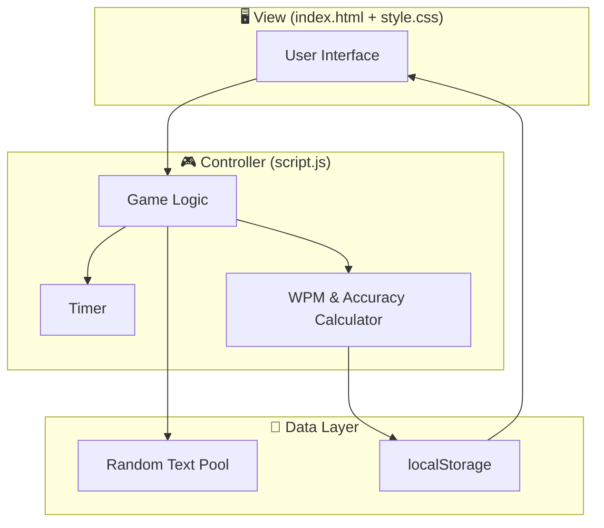
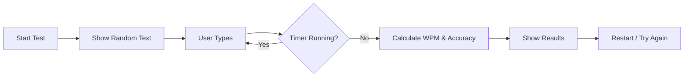
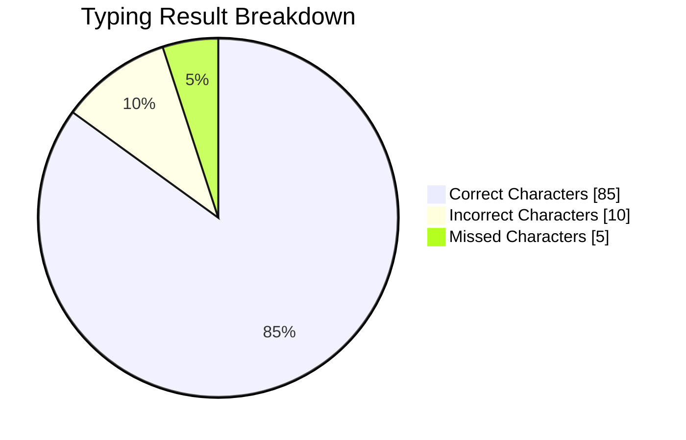
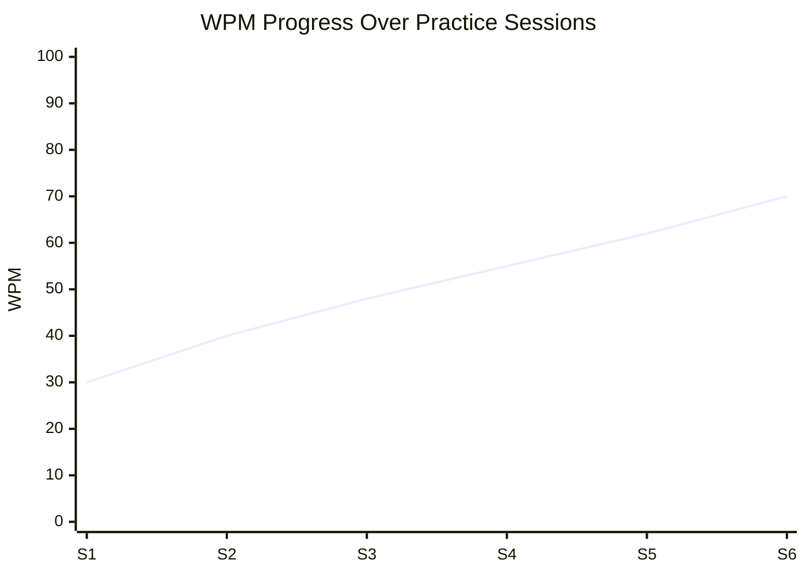

# ⌨️ Typing Speed Test Game

<p align="center">
  
</p>

<p align="center">
  <a href="https://github.com/AHMAD-0702/Typing---Speed---Test--Game/stargazers">
    
  </a>
  <a href="https://github.com/AHMAD-0702/Typing---Speed---Test--Game/network/members">
    
  </a>
  <a href="https://github.com/AHMAD-0702/Typing---Speed---Test--Game/blob/main/LICENSE">
    
  </a>
  <a href="https://github.com/AHMAD-0702/Typing---Speed---Test--Game/issues">
    
  </a>
  <a href="https://github.com/AHMAD-0702/Typing---Speed---Test--Game/pulls">
    
  </a>
  
  
  
  
</p>

<p align="center">
  
</p>

---

## 📑 Table of Contents

- [About The Project](#-about-the-project)
- [Live Demo](#-live-demo)
- [Features](#-features)
- [Tech Stack](#️-tech-stack)
- [Project Structure](#-project-structure)
- [Architecture](#-architecture)
- [Getting Started](#-getting-started)
  - [Prerequisites](#prerequisites)
  - [Installation](#installation)
  - [Running the Project](#running-the-project)
- [Usage](#-usage)
- [How It Works](#-how-it-works)
- [Performance Metrics](#-performance-metrics)
- [Screenshots](#️-screenshots)
- [Testing](#-testing)
- [Roadmap](#️-roadmap)
- [FAQ](#-faq)
- [Troubleshooting](#-troubleshooting)
- [Contributing](#-contributing)
- [Code of Conduct](#-code-of-conduct)
- [Changelog](#-changelog)
- [License](#-license)
- [Acknowledgements](#-acknowledgements)
- [Author](#-author)
- [Support](#-support)

---

## 📖 About The Project

**Typing Speed Test Game** is an interactive, browser-based web application that measures your **typing speed (WPM)** and **accuracy** in real time. Whether you are a beginner learning to type or a professional aiming to break your personal record, this tool provides an engaging and distraction-free environment to practice and improve.

> 🎯 **Goal:** To provide a simple, fast, and beautiful typing test tool — without any registration or installation.

### Why This Project?

- 🚀 **Lightweight** — no frameworks, no build tools, just pure HTML, CSS, and JavaScript.
- 🎨 **Clean UI** — modern, minimal design that focuses on your typing.
- 📱 **Fully Responsive** — works seamlessly on mobile, tablet, and desktop.
- ⚡ **Instant Feedback** — live WPM, accuracy, and timer updates.

---

## 🌐 Live Demo

> 🔗 **Try it here:** [Typing Speed Test Game — Live Demo](https://ahmad-0702.github.io/Typing---Speed---Test--Game/)

> _If GitHub Pages is not enabled yet, you can run the project locally by following the [Getting Started](#-getting-started) section._

---

## ✨ Features

| Feature | Description | Status |
|---------|-------------|--------|
| ⏱️ Real-time Timer | Countdown timer for every test | ✅ |
| 🚀 WPM Calculation | Words Per Minute calculated live | ✅ |
| 🎯 Accuracy Check | Every character's accuracy is tracked | ✅ |
| 🔄 Random Paragraphs | A new text appears each time | ✅ |
| 📊 Result Screen | Detailed result after the test | ✅ |
| 🎨 Responsive UI | Works on both mobile and desktop | ✅ |
| ⌨️ Keyboard Focus | Auto-focus on input for smooth typing | ✅ |
| 🌙 Dark Mode | Modern dark theme support | ⬜ |
| 🏆 High Score Save | Best score saved in localStorage | ⬜ |
| 🎚️ Difficulty Levels | Easy / Medium / Hard modes | ⬜ |
| 📤 Share Results | Share your score on social media | ⬜ |

**Legend:** ✅ Implemented · ⬜ Planned

---

## 🛠️ Tech Stack

<p align="center">
  
</p>

| Technology | Purpose |
|------------|---------|
| HTML5 | Semantic structure & layout |
| CSS3 | Styling, transitions & animations |
| JavaScript (ES6+) | Game logic, timer, WPM & accuracy calculation |
| Git & GitHub | Version control & collaboration |
| VS Code | Development environment |

### Browser Support

| Browser | Version | Supported |
|---------|---------|-----------|
| Chrome | 90+ | ✅ |
| Firefox | 88+ | ✅ |
| Edge | 90+ | ✅ |
| Safari | 14+ | ✅ |
| Opera | 76+ | ✅ |

---

## 📂 Project Structure

```
Typing---Speed---Test--Game/
│
├── index.html          # Main HTML file
├── style.css           # Styling & animations
├── script.js           # Game logic
├── assets/             # Images / Icons / Fonts
│   ├── home.png
│   └── result.png
├── .gitignore          # Git ignore rules
├── LICENSE             # MIT License
└── README.md           # Documentation
```

---

## 🏗️ Architecture

The project follows a simple **MVC-inspired** structure:



---

## 🚀 Getting Started

### Prerequisites

You only need a modern web browser. No Node.js, npm, or build tools required.

- A web browser (Chrome, Firefox, Edge, Safari)
- (Optional) [Git](https://git-scm.com/) for cloning
- (Optional) [VS Code](https://code.visualstudio.com/) + Live Server extension

### Installation

1. **Clone the repository**
   ```bash
   git clone https://github.com/AHMAD-0702/Typing---Speed---Test--Game.git
   ```

2. **Navigate to the folder**
   ```bash
   cd Typing---Speed---Test--Game
   ```

### Running the Project

**Option 1 — Direct open:**
Simply double-click `index.html` or open it in your browser.

**Option 2 — Live Server (recommended for development):**
```bash
# If you have VS Code, install "Live Server" extension
# Right-click index.html → "Open with Live Server"
```

**Option 3 — Python HTTP server:**
```bash
python -m http.server 8000
# Then open http://localhost:8000
```

---

## 🎮 Usage

1. **Open the app** in your browser.
2. Click the **Start** button to begin the test.
3. A random paragraph will appear — start typing in the input area.
4. Watch the **timer**, **WPM**, and **accuracy** update in real time.
5. When the timer ends, your **final score** will be displayed.
6. Click **Restart** to try again with a new paragraph.

### Example

```
⏱️ Time: 60s
🚀 WPM: 65
🎯 Accuracy: 96%
❌ Errors: 4
```

---

## 📊 How It Works



### WPM Formula

```
WPM = (Total Characters Typed / 5) / Time (in minutes)
Accuracy = (Correct Characters / Total Characters Typed) × 100
```

---

## 📈 Performance Metrics

| Metric | Description | Unit |
|--------|-------------|------|
| **WPM** | Words Per Minute | words/min |
| **CPM** | Characters Per Minute | chars/min |
| **Accuracy** | % of correct characters | % |
| **Errors** | Total mistakes | count |
| **Time** | Duration of the test | seconds |

### Sample Result Chart



### Progress Over Time (Example)



---

## 🖼️ Screenshots

| Home Screen | Result Screen |
|-------------|---------------|
|  |  |

> 📌 Replace these placeholder images with your actual project screenshots inside the `assets/` folder.

---

## 🧪 Testing

Since this is a static front-end project, testing is manual:

| Test Case | Steps | Expected Result |
|-----------|-------|-----------------|
| Start test | Click Start | Timer begins, text appears |
| Correct typing | Type correct characters | Accuracy = 100% |
| Incorrect typing | Type wrong characters | Accuracy decreases |
| Timer end | Wait for timer to finish | Result screen appears |
| Restart | Click Restart | New text, timer resets |

> 🚧 Automated tests (Jest / Playwright) are planned for future releases.

---

## 🗺️ Roadmap

- [x] Basic typing test
- [x] WPM calculation
- [x] Accuracy tracking
- [x] Responsive UI
- [ ] Dark mode
- [ ] Multiple difficulty levels (Easy / Medium / Hard)
- [ ] Leaderboard (local + online)
- [ ] Multiplayer mode
- [ ] User accounts & progress tracking
- [ ] Automated tests

See the [open issues](https://github.com/AHMAD-0702/Typing---Speed---Test--Game/issues) for a full list of proposed features and known issues.

---

## ❓ FAQ

<details>
<summary><strong>Do I need to install anything?</strong></summary>
No. Just open <code>index.html</code> in your browser.
</details>

<details>
<summary><strong>Is my data saved anywhere?</strong></summary>
Currently, no personal data is collected. Future versions may use <code>localStorage</code> to save your best scores.
</details>

<details>
<summary><strong>Can I use this on mobile?</strong></summary>
Yes — the UI is fully responsive and works on mobile browsers.
</details>

<details>
<summary><strong>How is WPM calculated?</strong></summary>
WPM = (Total Characters / 5) / Time in minutes. This is the standard formula used by most typing tests.
</details>

---

## 🛠️ Troubleshooting

| Problem | Possible Cause | Solution |
|---------|----------------|----------|
| Timer not starting | JavaScript disabled | Enable JavaScript in browser |
| Text not appearing | Missing `script.js` | Ensure all files are in the same folder |
| Styling broken | Missing `style.css` | Check file path in `index.html` |
| WPM shows 0 | No input detected | Click inside the input area before typing |

---

## 🤝 Contributing

Contributions are welcome! If you'd like to improve this project:

1. **Fork** the repo 🍴
2. **Create a branch** (`git checkout -b feature/AmazingFeature`)
3. **Commit** your changes (`git commit -m 'Add some AmazingFeature'`)
4. **Push** to the branch (`git push origin feature/AmazingFeature`)
5. **Open a Pull Request** 🚀

Please read [CONTRIBUTING.md](CONTRIBUTING.md) for details on our code of conduct and the process for submitting pull requests.

---

## 📜 Code of Conduct

This project adheres to the [Contributor Covenant Code of Conduct](https://www.contributor-covenant.org/version/2/1/code_of_conduct/). By participating, you are expected to uphold this code.

---

## 📝 Changelog

All notable changes to this project are documented in [CHANGELOG.md](CHANGELOG.md).

### [1.0.0] — Initial Release
- ✅ Basic typing test
- ✅ WPM & accuracy calculation
- ✅ Responsive UI

---

## 📜 License

Distributed under the **MIT License**. See [`LICENSE`](LICENSE) for more information.

---

## 🙏 Acknowledgements

- [Shields.io](https://shields.io/) — for badges
- [Skillicons](https://skillicons.dev/) — for tech stack icons
- [Capsule Render](https://github.com/kyechan99/capsule-render) — for header/footer banners
- [Readme Typing SVG](https://github.com/DenverCoder1/readme-typing-svg) — for animated text
- [Mermaid](https://mermaid.js.org/) — for diagrams & charts

---

## 👨‍💻 Author

**Ahmad**  
🔗 GitHub: [@AHMAD-0702](https://github.com/AHMAD-0702)

---

## 💖 Support

If you like this project, please consider:

- ⭐ **Starring** the repository
- 🐛 **Reporting** bugs via [Issues](https://github.com/AHMAD-0702/Typing---Speed---Test--Game/issues)
- 💡 **Suggesting** new features
- 📢 **Sharing** it with friends

---

<p align="center">
  
</p>

<p align="center">
  <strong>⭐ If you like this project, don't forget to give it a star! ⭐</strong>
</p>